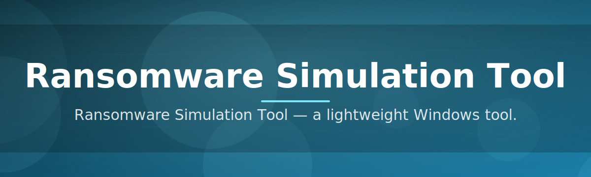

# Ransomware-Simulation-Tool-3169

Ransomware Simulation Tool — a lightweight Windows tool.

  

## Overview

Ransomware Simulation Tool — a lightweight Windows tool.

## License

[MIT License](LICENSE)
